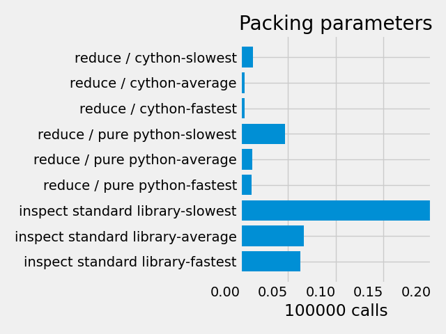

# reductable-params
[](https://badge.fury.io/py/reductable-params)

[](https://opensource.org/licenses/MIT)
[](https://github.com/nuxy/no-ai-badge)   

A low level Function packer & sender inspired by pluggy that is designed for mass sending
as well as ignoring unneeded parameters before sending to a function allowing for large chainable callbacks to be possible in any configuration order.


```python
from reductable_params import reduce


def test(a: int, b: str | None = None):
    pass

def child(a: int):
    print(f"GOT {a}")

def what_is_b(b: str | None):
    print(f"B Is {b}")

def main():
    func = reduce(test)
    # defaults can be installed before possibly sending 
    # these to a child function.
    data = func.install(1) # {"a": 1, b: None}
    
    child_func = reduce(child)

    # Calling child_func will send itself off. 
    # You can customize the data after installing it too.
    # allowing for tons of creatives uses.
    child_func(data) # B Parameter is ignored here.
    # "GOT 1"

    child_2 = reduce(what_is_b)
    child_2(data)
    # B Is None


if __name__ == "__main__":
    main()
```

## Benchmarks
I decided to run benchmarks incase mainly to prove that this could be better than using `inspect.signature` alone and better for use on a mass scale when running the `install()` function.
Note that smaller is better and that the timer is measured in seconds running `bench.py` which I have in this repo incase you want to see for yourself.



I'll add a comparison with pluggy in the future as soon as I get around to doing so.


